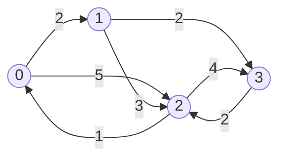
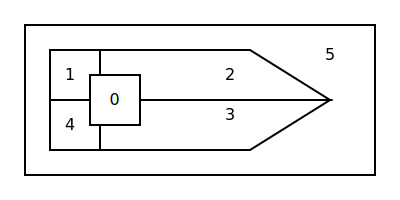

# Exercícios Complementares

[Todos os exercícios](../exercicios)

[Link original](https://www.ime.usp.br/~macmulti/exercicios/extra/index.html)

## 1
Dada uma sequência $x_0 + x_1 , ..., + x_{k-1}$  de números inteiros, determinar uma
subsequência crescente de comprimento máximo.

Exemplo: Na sequência
```
5, 2, 7, 1, 4, 11, 6, 9
         *  *      *  *
```
a subsequência sublinhada é máxima e tem comprimento 4.

## 2
Ajude um rato a encontrar um pedaço de queijo num labirinto como o do desenho abaixo:

```
          ┌───┬───┬───┬───┬───┬───┬───┬───┬───┬───┬───┐
queijo -> │   │   │ x │ x │   │   │   │   │   │   │   │
          ├───┼───┼───┼───┼───┼───┼───┼───┼───┼───┼───┤
          │   │ x │   │   │ x │   │ x │   │ x │ x │   │
          ├───┼───┼───┼───┼───┼───┼───┼───┼───┼───┼───┤
          │   │   │ x │   │ x │   │ x │   │   │   │ x │
          ├───┼───┼───┼───┼───┼───┼───┼───┼───┼───┼───┤
          │   │ x │   │ x │   │   │   │ x │ x │   │   │
          ├───┼───┼───┼───┼───┼───┼───┼───┼───┼───┼───┤
          │   │   │   │ x │   │ x │   │   │   │ x │   │
          ├───┼───┼───┼───┼───┼───┼───┼───┼───┼───┼───┤
          │   │ x │   │   │   │   │   │   │ x │   │   │ <- rato
          └───┴───┴───┴───┴───┴───┴───┴───┴───┴───┴───┘
```

Um labirinto desses pode ser representado por uma matriz retangular $L$, cujo elemento $l_{ij}$
vale 0 ou -1 conforme a casa correspondente do labirinto seja uma passagem livre ou uma parede,
respectivamente.

Um método geral para resolver esse problema consiste em marcar com o número $k$ ($k = 1,2, ...$)
todas as casas livres que estejam a exatamente $k-1$ passos de distância do queijo, pelo caminho
mais curto possível. Suponha que, a cada passo, o rato possa se deslocar de apenas uma casa na
vertical ou na horizontal. Então, rotula-se inicialmente a posição do queijo com `1` e para cada
$k>2$ examinam-se todas as casas livres do labirinto, marcando-se com `k` aquelas ainda não marcadas
e que sejam adjacentes a alguma casa marcada com $k-1$. A marcação continua até ser atingido um valor
de $k$ (28 no exemplo abaixo) tal que nenhuma casa esteja em condições de ser marcada.
Ao final da marcação teremos a seguinte matriz, supondo o queijo em (5,10):

```
 ┌────┬────┬────┬────┬────┬────┬────┬────┬────┬────┬────┐
 │ 26 │ 27 │ -1 │ -1 │ 12 │ 11 │ 10 │  9 │ 10 │ 11 │ 12 │
 ├────┼────┼────┼────┼────┼────┼────┼────┼────┼────┼────┤
 │ 25 │ -1 │  0 │  0 │ -1 │ 12 │ -1 │  8 │ -1 │ -1 │ 13 │
 ├────┼────┼────┼────┼────┼────┼────┼────┼────┼────┼────┤
 │ 24 │ 25 │ -1 │  0 │ -1 │ 13 │ -1 │  7 │  6 │  5 │ -1 │
 ├────┼────┼────┼────┼────┼────┼────┼────┼────┼────┼────┤
 │ 23 │ -1 │ 21 │ -1 │ 15 │ 14 │ 15 │ -1 │ -1 │  4 │  3 │
 ├────┼────┼────┼────┼────┼────┼────┼────┼────┼────┼────┤
 │ 22 │ 21 │ 20 │ -1 │ 16 │ -1 │ 16 │ 17 │ 18 │ -1 │  2 │
 ├────┼────┼────┼────┼────┼────┼────┼────┼────┼────┼────┤
 │ 23 │ -1 │ 19 │ 18 │ 17 │ 18 │ 17 │ 18 │ -1 │  2 │  1 │
 └────┴────┴────┴────┴────┴────┴────┴────┴────┴────┴────┘
```

O caminho mais curto até o queijo pode então ser determinado, partindo-se da posição do rato e passando
a cada etapa para uma casa adjacente cuja numeração seja menor do que a atual. Por exemplo, partindo de
`[0,0]` o rato precisará percorrer pelo menos 26 casas para chegar ao queijo:

```
[0,0], [1,0], [2,0], [3,0], [4,0], [4,1], [4,2], ..., [4,10], [5,10].
```

Dados o labirinto (matriz $L$ com elementos `0` e `-1`) e as posições do rato e do queijo, determine o
caminho mais curto que o rato deve percorrer até encontrar o queijo, se tal caminho existir.

Sugestão: Escreva uma função que efetua a marcação (recebendo como parâmetros a matriz $L$, suas dimensões
e a posição do queijo) e um outro que imprime o caminho (recebendo como parâmetros a matriz $L$ já marcada,
suas dimensões e a posição inicial do rato).

## 3
Considere `n` cidades numeradas de `0` a `n-1` que estão interligadas por uma série de estradas de mão única.
Um caixeiro viajante (como o Maluf em época de eleição) deseja visitar todas as cidades e retornar a cidade
de partida. Dado o tempo que o caixeiro leva para ir de uma cidade a outra, faça um programa que imprime
o itinerário que o caixeiro deve fazer de tal forma que ele visite cada cidade exatamente uma vez e gaste o
menor tempo possível, se um tal itinerário existir. Para isso os tempos são dados pelos elementos de uma matriz
quadrada $T_{nxn}$ , cujos elementos $t_{ij}$ representam o tempo para ir da cidade $i$ para a cidade $j$.
Se $t_{ij}$ for zero isso significa que não existe estrada que vai da cidade $i$ para a cidade $j$.
Assim, os elementos da linha $i$ indicam as estradas que saem da cidade $i$ e os tempos que o caixeiro gasta
para pecorrê-las, e os elementos da coluna $j$ indicam as estradas que chegam à cidade $j$ e os tempos
que o caixeiro gasta para percorrê-las.

Por convenção $l_{ii} = 1$. A figura mostra um exemplo para `n = 4`.

$$
\begin{bmatrix}
 1 & 2 &  5 & 0 \\
 0 & 1 &  3 & 2 \\
 1 & 0 &  1 & 2 \\
 0 & 0 &  4 & 1 \\
\end{bmatrix}
$$



No exemplo acima, se o caixeiro visitar as cidades `3, 2, 0, 1, 3` gastará o menor tempo possível.

## 4 Armazenamento e Recuperação de Informações
A estrutura de **lista ligada** é muito comum no armazenamento de grandes volumes de informações.
Consiste em ligar de uma forma lógica os diversos elementos de um conjunto, com o objetivo de permitir
um acesso mais rápido a cada um deles. É utilizada quando o acesso ao conjunto de informações for muito
frequente, seja para atualizações, seja para consultas.

Pode-se construir uma estrutura de lista ligada utilizando-se uma matriz onde uma das colunas por
exemplo seja reservada para as diversas ligações.

Exemplo:
Considere o arquivo de uma empresa relacionando para cada funcionário seu número, seu nível
salarial e seu departamento. Como a administração desta empresa é feita a nível de departamento
é importante que no arquivo os funcionários de cada um dos departamentos estejam relacionados entre si
e ordenados sequencialmente pelo seu número. Como são frequentes as mudanças interdepartamentais no
quadro de funcionários, não é conveniente reestruturar o arquivo a cada uma destas mudanças.
Desta maneira, o arquivo poderia ser organizado da seguinte forma:

**Matriz A**

| linha | nº do funcionário | nível | departamento | ligação |
|-------|-------------------|-------|--------------|---------|
| 0     | 123               | 7     | 1            | 5       |
| 1     | 8765              | 12    | 1            | -1      |
| 2     | 9210              | 4     | 2            | -1      |
| 3     | 2628              | 4     | 3            | 6       |
| 4     | 5571              | 8     | 2            | 2       |
| 5     | 652               | 1     | 1            | 9       |
| 6     | 7943              | 1     | 3            | -1      |
| 7     | 671               | 5     | 3            | 12      |
| 8     | 1956              | 11    | 2            | 11      |
| 9     | 1398              | 6     | 1            | 10      |
| 10    | 3356              | 3     | 1            | 1       |
| 11    | 4050              | 2     | 2            | 4       |
| 12    | 2468              | 9     | 3            | 3       |

**Matriz B**

| departamento | 1 | 2 | 3 |
|--------------|---|---|---|
| início       | 0 | 8 | 7 |

> Observe que a quarta coluna (_ligação_) da matriz $A$ estabelece a ordem interna dos funcionários de cada departamento,
> apontando para cada um qual o próximo em ordem numérica no seu departamento. O número `-1` indica ser o último funcionário
> do departamento. Para cada novo funcionário da companhia é atribuído um número e é acrescentada uma linha na matriz e
> preenchidas as colunas nível, departamento e ligação. Para mudanças interdepartamentais basta alterar a terceira e quarta colunas.
> A matriz $B$ indica, para cada departamento, a linha do primeiro funcionário.

Escreva um programa que:

### a
Admita a existência de uma matriz de funcionários como a especificada acima
(as matrizes $A$ e $B$ devem ser lidas, inclusive a quarta coluna da matriz $A$).

### b
Permita através de funções (uma para cada caso) as seguintes operações, atualizando as matrizes $A$ e $B$:
 
1. Admissão de funcionário novo na empresa;
2. Demissão de funcionário da empresa;
3. Mudança de departamento por um funcionário.

Para estas operações devem ser lidas as informações:

- Código do tipo da operação, sendo: 1 para operação de admissão, 2 para operação de demissão e 3 para mudança de departamento;
- Número do funcionário;
- Número do departamento ao qual o funcionário passa a pertencer (não utilizado para operação de demissão);
- Número do departamento do qual o funcionário foi desligado (só utilizado para operação de demissão).

O programa deve imprimir um relatório contendo:

- As matrizes $A$ e $B$ originais;
- Para cada operação:
  - o tipo de operação realizada e os dados da operação;
  - a forma final das matrizes $A$ e $B$.

## 5
(POLI 83) Dado um mapa contendo vários países, desejamos colori-lo com o menor número possível de cores, de tal
maneira que países vizinhos tenham cores distintas. Já foi demonstrado que qualquer mapa pode ser colorido com 4
cores diferentes. Além disso, existem mapas que não podem ser coloridos com menos do que 4 cores, como por exemplo
o seguinte mapa com 8 países:


Faça um algoritmo que, dado um mapa com `n` países e 4 cores distintas, forneça como resposta uma cor para
cada país, de forma que dois países vizinhos não possuam a mesma cor. Em `C` você pode declarar
```
enum cor = {verde, amarelo, vermelho, azul, nenhuma}
```
_Em [Zig também](https://zig.guide/language-basics/enums/)._

Os dados para o problema são os seguintes:

- um número natural `n` representando o número de países (que são numerados de 0 a n-1);
- um número natural `m < n` representando o número de vizinhos máximo que um país pode ter;
- uma matriz natural $VIZ_{nxm}$ representando o mapa da seguinte maneira: os primeiros
  elementos da linha `i` são os números dos vizinhos do país `i` de número menor que `i`,
  o resto da linha é preenchida com -1. Por exemplo, para o mapa desenhado abaixo
  ($n = 6$) teríamos a seguinte matriz $VIZ$:

$$
\begin{bmatrix}
-1 & -1 & -1 & -1 & -1 \\
 0 & -1 & -1 & -1 & -1 \\
 1 &  0 & -1 & -1 & -1 \\
 2 &  0 & -1 & -1 & -1 \\
 0 &  1 &  3 & -1 & -1 \\
 1 &  2 &  3 &  4 & -1 \\
\end{bmatrix}
$$



Construa o algoritmo seguindo o seguinte roteiro:

### a
Escreva uma _função lógica_ de nome **color** que recebe como parâmetros:
- um natural `p` (representando o número de um país);
- um natural `m`;
- uma cor `c`;
- um vetor inteiro $VIZPA$, de `m` elementos (representando os vizinhos do país `p` -- de número menor que `p` -- da mesma
  forma que nas linhas da matriz $VIZ$);
- um vetor $COR$ (representando as cores já atribuídas aos países de número menor que `p`).

A função deve assumir _falso_ se o país `p` não pode ser colorido com a cor `c` e assumir o valor _verdadeiro_ em caso contrário.

### b
Escreva uma _função_ de nome **pintar** que recebe como parâmetros:
- um natural `p` (representando o número de um país);
- um natural `m`;
- um vetor natural $VIZPA$ de `m` elementos (representando os vizinhos do país `p`,
  da mesma forma que nas linhas da matriz $VIZ$);
- um vetor $COR$ (representando as cores já atribuídas aos países de número menor que `p`).

A função deve assumir o valor da menor cor com a qual é possível colorir o país `p` ou assumir o valor `nenhuma`
se não for possível colorir o país `p` com nenhuma das 4 cores. Para fazer esta função use a função **color** do
item (a) (mesmo que você não a tenha feito).

### c
Escreva uma função de nome recor com os seguintes parâmetros:

1. parâmetros de entrada:
  - um natural `p` (representando o número de um país);
  - um natural `m`;
  - uma matriz natural $VIZ_{nxm}$ (representando o mapa da maneira dada na descrição do problema);
  - um vetor $COR$ (representando as cores já atribuídas aos países de número menor que `p`).
2. parâmetros de saída:
  - um natural `país` (representando o número de um país);
  - `ncor` (representando uma cor).

A função deve colocar em `país` o maior número menor que `p` tal que este país possa ser colorido com uma cor maior
que sua cor original (dada no vetor $COR$). Em ncor deve ser colocada esta nova cor. Eventualmente pode haver mais
de uma possível resposta para `ncor`. A função deve colocar em `ncor` a menor cor entre elas. Para fazer esta função
use a função **color** do item (a), mesmo que você não a tenha feito.

### d
Faça um algoritmo que lê e imprime os naturais `n` e `m` e uma matriz de vizinhança $VIZ_{nxm}$ e fornece como
resposta um vetor $COR$ de `n` elementos onde `COR[i]` representa a cor do país `i`, de forma que países vizinhos
tenham cores diferentes. (Você deve usar somente 4 cores). Use a função recor do item (c) e a função pintar do item
(b), mesmo não as tendo feito.

Sugestão: Você deve dar a menor cor ao país de número 0 e para os países de números `1` a `n-1` dar a menor cor possível.
Se ao tentar colorir algum país você verificar que não é possível lhe atribuir nenhuma das 4 cores, você deve alterar
a cor de algum país colorido anteriormente e recomeçar a coloração a partir do país que teve a cor alterada.

## 6
No _jogo dos oito ladrilhos_ nós temos oito números colocados em uma matriz 3x3.
Uma possível configuração do jogo é mostrada abaixo:
```
┌───┬───┬───┐
│ 1 │ 3 │ 4 │
├───┼───┼───┤
│ 8 │ 6 │ 2 │
├───┼───┼───┤
│ 7 │   │ 5 │
└───┴───┴───┘
```

A localização do branco faz parte da configuração. O objetivo do jogo é a partir de uma configuração inicial,
por exemplo a configuração acima, chegar na configuração final, que é mostrada abaixo, através de movimentações
do espaço em branco para a esquerda, para direita, para cima ou para baixo. Portanto temos quatro possíveis movimentos,
alguns dos quais não podem ser aplicados em determinadas configurações. Por exemplo, somente três movimentos (esquerda, cima,
direita) podem ser aplicados na configuração acima.

```
┌───┬───┬───┐
│ 1 │ 2 │ 3 │
├───┼───┼───┤
│ 8 │   │ 4 │
├───┼───┼───┤
│ 7 │ 6 │ 5 │
└───┴───┴───┘
```
_Configuração Final_

Faça um programa que, dada uma configuração inicial qualquer, dá como saída uma sequência de movimentações que conduzem
à configuração final, se uma tal sequência existir, pois para metade das possíveis configurações iniciais não existe uma
tal sequência.

## 7
### a
Faça um programa cuja saída são todas as possíveis maneiras de dispormos 8 rainhas em um tabuleiro de xadrez de tal maneira
que elas não se ataquem. Por exemplo uma das possíveis maneiras de dispor as rainhas é a seguinte:

```
┌───┬───┬───┬───┬───┬───┬───┬───┐
│ R │   │   │   │   │   │   │   │
├───┼───┼───┼───┼───┼───┼───┼───┤
│   │   │   │   │   │   │ R │   │
├───┼───┼───┼───┼───┼───┼───┼───┤
│   │   │   │   │ R │   │   │   │
├───┼───┼───┼───┼───┼───┼───┼───┤
│   │   │   │   │   │   │   │ R │
├───┼───┼───┼───┼───┼───┼───┼───┤
│   │ R │   │   │   │   │   │   │
├───┼───┼───┼───┼───┼───┼───┼───┤
│   │   │   │ R │   │   │   │   │
├───┼───┼───┼───┼───┼───┼───┼───┤
│   │   │   │   │   │ R │   │   │
├───┼───┼───┼───┼───┼───┼───┼───┤
│   │   │ R │   │   │   │   │   │
└───┴───┴───┴───┴───┴───┴───┴───┘
```

### b
Altere o seu programa de tal forma que dado `n` ele imprime todas as possíveis maneiras de dispor `n` rainhas em um tabuleiro `n x n`
de tal maneira que duas a duas elas não se ataquem.

## 8
Dados `n` e `m` faça um programa que verifica se é possível dispor `m` rainhas em um tabuleiro `n x n` de tal forma que toda
posição do tabuleiro é atacada por pelo menos uma rainha, em caso afirmativo o seu programa deve ainda imprimir
uma disposição das rainhas em que isso ocorre.
